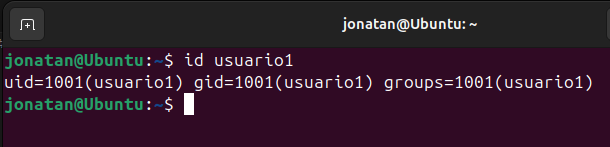
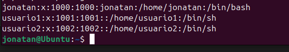
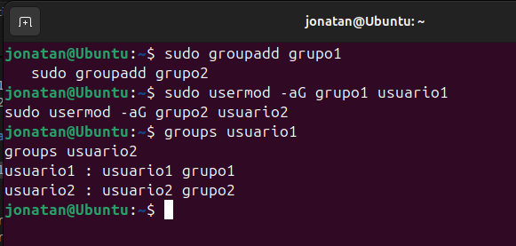
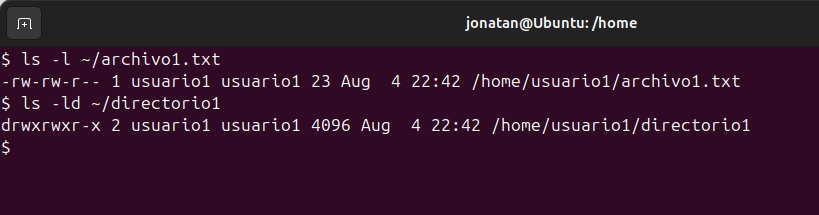
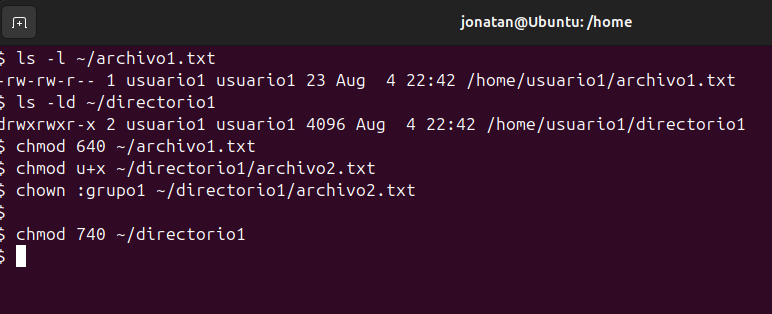
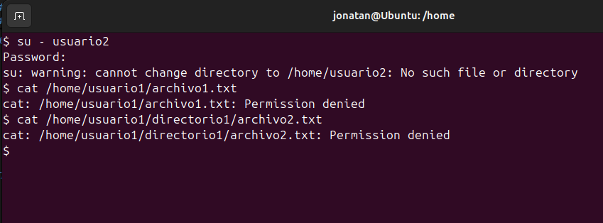
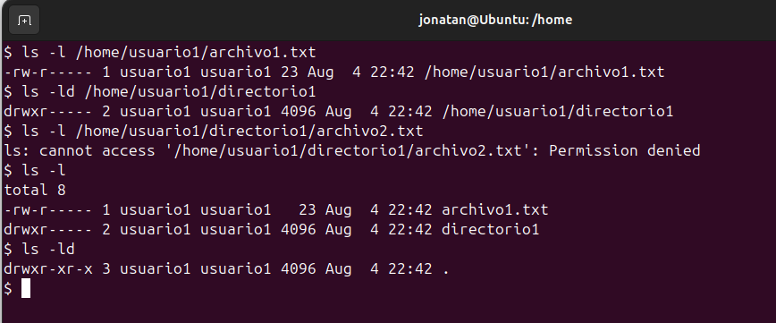

# Gestión de Usuarios

## Parte 1: Creación de Usuarios

1. **Creación de Usuarios**
    ```bash
   sudo useradd usuario1
   sudo useradd usuario2
   sudo useradd usuario3
   ```

2. **Asignación de Contraseñas**
    ```bash
    sudo passwd usuario1
    sudo passwd usuario2
    sudo passwd usuario
    ```

3. **Información de Usuario 1**
    ```bash
    id usuario1
    ```
    

4. **Eliminar usuario 3**
    ```bash
    sudo userdel usuario3
    ```
    

# Gestión de Grupos

## Parte 2: Gestión de Grupos

1. **Creación de Grupos**

   Para crear los grupos `grupo1` y `grupo2`, se utilizan los siguientes comandos:

   ```bash
   sudo groupadd grupo1
   sudo groupadd grupo2
   ```
2. **Agregar Usuarios a Grupos**

    Para agregar usuario1 a grupo1 y usuario2 a grupo2:

    ```bash
    sudo usermod -aG grupo1 usuario1
    sudo usermod -aG grupo2 usuario2
    ```
    

3. **Verificar Membresía**

    Para verificar que los usuarios han sido agregados a los grupos, se usa el comando groups:

    ```bash
    groups usuario1
    groups usuario2
    ```
    

4. **Eliminar Grupo**

    Para eliminar grupo2:
    ```bash
    sudo groupdel grupo2
    ```

# Gestión de Permisos

## Parte 3: Gestión de Permisos

1. **Creación de Archivos y Directorios**
    Como `usuario1`, crea un archivo llamado `archivo1.txt` en su directorio principal y escribe algo en él. Luego, crea un directorio llamado `directorio1` y dentro de ese directorio, un archivo llamado `archivo2.txt`.

    ```bash
    su - usuario1
    echo "Contenido del archivo1" > ~/archivo1.txt
    mkdir ~/directorio1
    echo "Contenido del archivo2" > ~/directorio1/archivo2.txt
    ```

2. **Verificar Permisos**
    Verifica los permisos del archivo y directorio usando ls -l y ls -ld respectivamente.

    ```bash
    ls -l ~/archivo1.txt
    ls -ld ~/directorio1
    ```
    

3. **Modificar Permisos usando chmod con Modo Numérico**
    Cambia los permisos de archivo1.txt para que sólo usuario1 pueda leer y escribir (permisos rw-), el grupo pueda leer (permisos r--) y nadie más pueda hacer nada.

    ```bash
    chmod 640 ~/archivo1.txt
    ```

4. **Modificar Permisos usando chmod con Modo Simbólico**
    Agrega permiso de ejecución al propietario del archivo2.txt.

    ```bash
    chmod u+x ~/directorio1/archivo2.txt
    ```
5. **Cambiar el Grupo Propietario**
    Cambia el grupo propietario de archivo2.txt a grupo1.

    ```bash
    chown :grupo1 ~/directorio1/archivo2.txt
    ```
6. **Configurar Permisos de Directorio**

    Cambia los permisos de directorio1 para que sólo el propietario pueda entrar (permisos rwx), el grupo pueda listar contenidos pero no entrar (permisos r--), y otros no puedan hacer nada.

    ```bash
    chmod 740 ~/directorio1
    ```
    

7. **Comprobación de Acceso**
    Intenta acceder al archivo1.txt y directorio1/archivo2.txt como usuario2.

    ```bash
    su - usuario2
    cat /home/usuario1/archivo1.txt
    cat /home/usuario1/directorio1/archivo2.txt
    ```
    
        
8. **Verificación Final**
    Verifica los permisos y propietario de los archivos y directorio nuevamente con ls -l y ls -ld.

    ```bash
    ls -l /home/usuario1/archivo1.txt
    ls -ld /home/usuario1/directorio1
    ls -l /home/usuario1/directorio1/archivo2.txt

    ls -l
    ls -ld
    ```
    

### Reflexión:

#### ¿Por qué es importante gestionar correctamente los usuarios y permisos en un sistema operativo?

Gestionar usuarios y permisos es esencial para la **seguridad y privacidad**. Sin una gestión adecuada, es fácil que se produzcan accesos no autorizados, lo que puede comprometer datos sensibles. Además, facilita la **organización y eficiencia**, asegurando que cada usuario tenga acceso solo a lo que necesita. Personalmente, creo que una buena gestión es clave para evitar problemas y mantener el control en sistemas compartidos.

#### ¿Qué otros comandos o técnicas conoces para gestionar permisos en Linux?

Además de `chmod` y `chown`, uso **ACLs** para permisos más detallados, y **umask** para establecer permisos predeterminados. Me gusta también **sudo** para controlar el acceso a comandos privilegiados. En mi experiencia, usar **grupos de usuarios** y herramientas como **SELinux** ayuda a mejorar la seguridad y facilita la administración de sistemas complejos.


    

