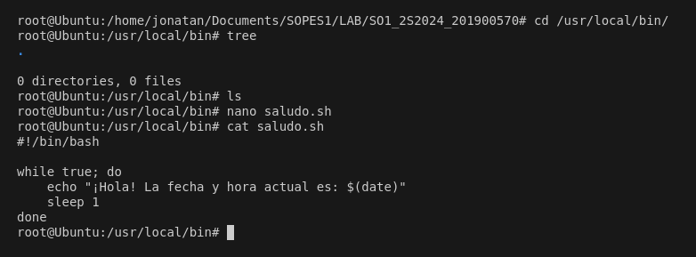
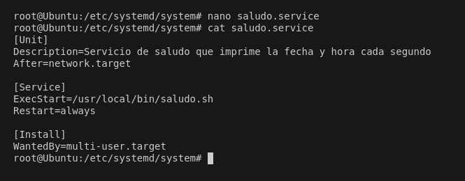
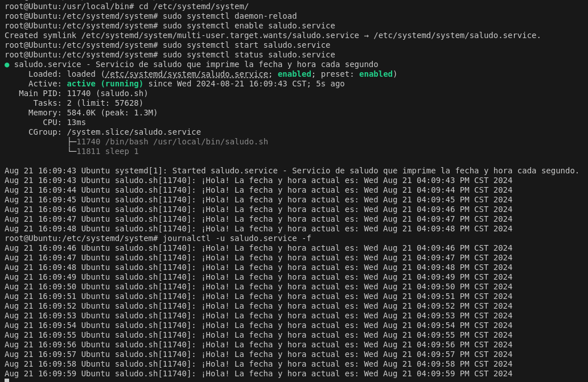

# Servicio de Saludo

Este servicio imprime un saludo y la fecha actual cada segundo de forma infinita.

## Instalación

1. Crear el script en `/usr/local/bin/saludo.sh`:

    ```bash
    sudo nano /usr/local/bin/saludo.sh
    ```

2. Copiar el siguiente contenido al script:

    ```bash
    #!/bin/bash

    while true; do
        echo "¡Hola! La fecha y hora actual es: $(date)"
        sleep 1
    done
    ```

3. Hacer el script ejecutable:

    ```bash
    sudo chmod +x /usr/local/bin/saludo.sh
    ```

    

4. Crear el archivo de unidad `systemd` en `/etc/systemd/system/saludo.service`:

    ```bash
    sudo nano /etc/systemd/system/saludo.service
    ```

5. Copiar el siguiente contenido al archivo de unidad:

    ```ini
    [Unit]
    Description=Servicio de saludo que imprime la fecha y hora cada segundo
    After=network.target

    [Service]
    ExecStart=/usr/local/bin/saludo.sh
    Restart=always

    [Install]
    WantedBy=multi-user.target
    ```

    

6. Recargar `systemd`:

    ```bash
    sudo systemctl daemon-reload
    ```

7. Habilitar el servicio para que se inicie con el sistema:

    ```bash
    sudo systemctl enable saludo.service
    ```

8. Iniciar el servicio:

    ```bash
    sudo systemctl start saludo.service
    ```

## Ver logs del servicio

Para ver los logs generados por el servicio:

```bash
journalctl -u saludo.service -f
```

