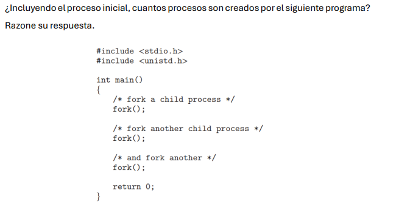

### Análisis por pasos:

#### Primera llamada a `fork()`:

- El proceso original (proceso 1) llama a `fork()`, creando un nuevo proceso hijo.
- Ahora hay dos procesos: el original (proceso 1) y el nuevo proceso hijo (proceso 2).

#### Segunda llamada a `fork()`:

- Tanto el proceso original (proceso 1) como el hijo (proceso 2) ejecutan esta llamada a `fork()`, ya que ambos siguen ejecutando el código.
- Cada uno de ellos genera un nuevo proceso hijo:
  - El proceso 1 genera el proceso 3.
  - El proceso 2 genera el proceso 4.
- Ahora hay cuatro procesos en total: proceso 1, proceso 2, proceso 3, y proceso 4.

#### Tercera llamada a `fork()`:

- Los cuatro procesos existentes (proceso 1, proceso 2, proceso 3 y proceso 4) ejecutan esta llamada a `fork()`.
- Cada uno de estos cuatro procesos genera un nuevo proceso hijo:
  - El proceso 1 genera el proceso 5.
  - El proceso 2 genera el proceso 6.
  - El proceso 3 genera el proceso 7.
  - El proceso 4 genera el proceso 8.
- Ahora hay ocho procesos en total: proceso 1, proceso 2, proceso 3, proceso 4, proceso 5, proceso 6, proceso 7 y proceso 8.

### Resultado:

- Incluyendo el proceso inicial, el programa crea un total de **8 procesos** (1 proceso original + 7 procesos creados por `fork()`).
