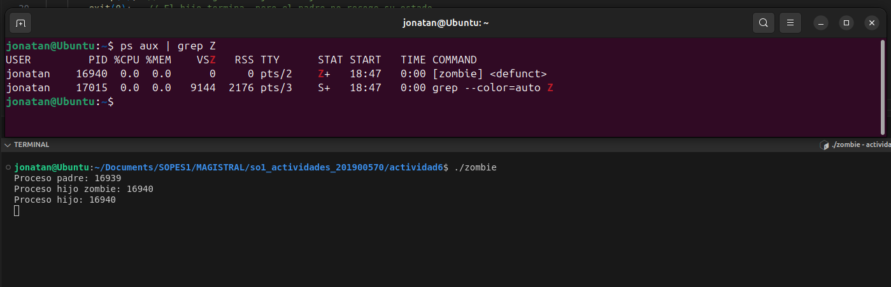

# Proceso Zombie

## Ejecución

## Explicación
Usando el comando `ps aux | grep "Z"` se puede ver el proceso zombie, en este caso el proceso hijo se convierte en zombie, ya que el proceso padre termina antes que el hijo, por lo que el proceso hijo queda en estado zombie.
