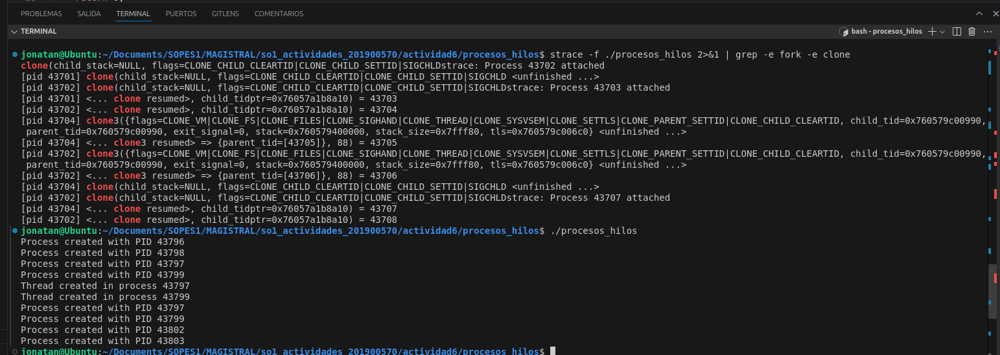

# Análisis del Programa `procesos_hilos`

Este documento contiene un análisis del comportamiento del programa `procesos_hilos` en cuanto a la creación de procesos e hilos.

## Comportamiento observado

A partir de la ejecución del programa, se ha podido observar la creación de varios procesos e hilos. A continuación, se detalla la información relevante obtenida.

### Procesos creados

Se observa que se crearon los siguientes procesos únicos:

- **PID 43796**: Proceso padre original.
- **PID 43798**: Proceso hijo creado en el primer `fork()`.
- **PID 43797**: Proceso hijo creado por un `fork()` dentro del proceso hijo anterior.
- **PID 43799**: Proceso hijo creado en el tercer `fork()`.
- **PID 43802 y 43803**: Otros procesos creados en el `fork()` final.

**Total de procesos creados: 5**.

### Hilos creados

En la salida del programa, se reportaron hilos creados en dos procesos distintos:

- Hilo creado en el proceso **43797**.
- Hilo creado en el proceso **43799**.

**Total de hilos creados: 2**.

## Resumen de resultados

- **Total de procesos únicos creados:** 5.
- **Total de hilos únicos creados:** 2.

El programa ha mostrado el comportamiento esperado, creando procesos e hilos mediante las llamadas a `fork()` y `pthread_create()` respectivamente. La verificación se realizó utilizando mensajes de depuración y herramientas como `ps` y `strace`.
